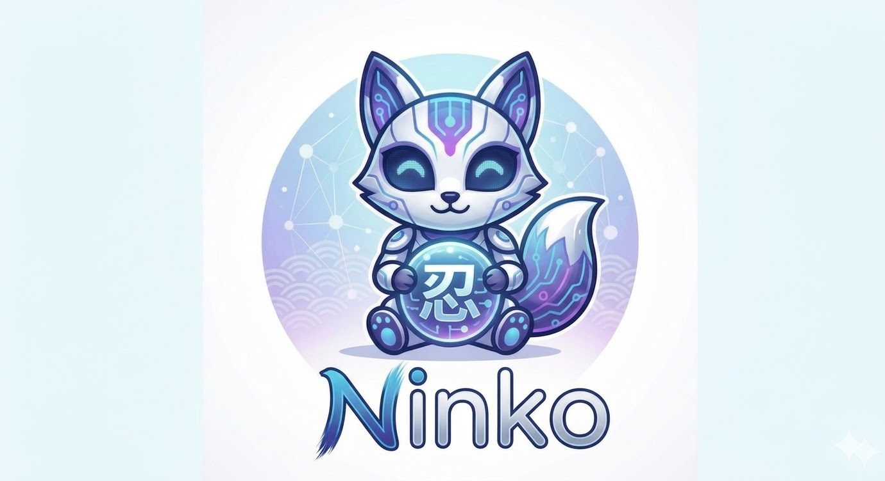

<p align="center">
  
</p>

<h1 align="center">Ninko</h1>

<p align="center"><strong>Modular, AI-powered IT Operations Platform</strong></p>

<p align="center">
Ninko connects a local LLM to your infrastructure. Ask questions in chat, trigger workflows, and let agents autonomously handle tasks — without any data leaving your network.
</p>

<p align="center">
  <a href="CHANGELOG.md"></a>
  <a href="CHANGELOG.md"></a>
  <a href="https://www.python.org/"></a>
  <a href="https://fastapi.tiangolo.com/"></a>
  <a href="LICENSE"></a>
</p>

> **Beta:** Ninko is functional and actively used in production environments, but the API and module interfaces may still change. Feedback and contributions welcome.

---

## Features

- **Chat Interface** – Control your entire IT infrastructure in natural language
- **19 built-in modules** – Kubernetes, Proxmox, GLPI, FritzBox, Pi-hole, Home Assistant, IONOS DNS, Docker, WordPress, Teams, Qdrant, Tasmota, OPNsense, and more
- **4-tier orchestrator routing** – Direct / Module Agent / Dynamic Agent / Pipeline
- **Long-term memory** – ChromaDB-backed semantic memory across all sessions
- **Local LLMs** – Ollama, LM Studio, or any OpenAI-compatible API (no cloud required)
- **Workflow engine** – Visual DAG editor for automated multi-step tasks
- **Dynamic agents** – AI creates specialized agents at runtime on demand
- **Skills system** – Reusable procedural knowledge as SKILL.md files
- **TTS/STT** – Piper (local) + Whisper for voice input and output
- **Telegram bot** – Full remote access via messenger including voice messages
- **Safeguard** – LLM-based classifier that intercepts destructive or state-changing actions and prompts for confirmation before execution
- **Multilingual** – 10 languages, automatically selected based on the user's language
- **Plugin system** – ZIP-installable modules without restart

---

## Screenshots

<table>
  <tr>
    <td align="center" width="50%">
      <br>
      <sub><b>Chat interface — Dark Mode</b></sub>
    </td>
    <td align="center" width="50%">
      <br>
      <sub><b>Chat interface — Light Mode</b></sub>
    </td>
  </tr>
  <tr>
    <td align="center" width="50%">
      <br>
      <sub><b>CodeLab — Code execution &amp; text improvement</b></sub>
    </td>
    <td align="center" width="50%">
      <br>
      <sub><b>Automation — Visual DAG workflow editor</b></sub>
    </td>
  </tr>
  <tr>
    <td align="center" width="50%">
      <br>
      <sub><b>FritzBox — Network management dashboard</b></sub>
    </td>
    <td align="center" width="50%">
      <br>
      <sub><b>Pi-hole — DNS blocking &amp; query log</b></sub>
    </td>
  </tr>
</table>

---

## Quickstart (Docker Compose)

### Prerequisites

- Docker + Docker Compose
- A running LLM backend: [Ollama](https://ollama.ai) or [LM Studio](https://lmstudio.ai)

### 1. Clone the repository

```bash
git clone https://github.com/natorus87/ninko.git
cd ninko
```

### 2. Create configuration

```bash
cp .env.example .env
# Open .env and set SQLITE_SECRETS_KEY:
# python3 -c "import secrets; print(secrets.token_hex(32))"
```

### 3. Start the stack

```bash
docker compose up -d
```

The dashboard is available at **http://localhost:8000**.

On first start, configure your LLM backend under **Settings → LLM Provider** (Ollama, LM Studio, or OpenAI-compatible).

---

## Architecture

```
┌──────────────────────────────────────────────────────┐
│                    Ninko Dashboard                   │
│   Chat  │  Kubernetes  │  Proxmox  │  GLPI  │  ...  │
└──────────────────────┬───────────────────────────────┘
                       │
┌──────────────────────▼───────────────────────────────┐
│               Orchestrator Agent                     │
│  Tier 1: Direct │ Tier 2: Module │ Tier 3: Dynamic  │
│                    Tier 4: Pipeline                  │
└──────────────────────┬───────────────────────────────┘
                       │
┌──────────────────────▼───────────────────────────────┐
│                 Module Registry                      │
│        Auto-Discovery · backend/modules/             │
└──────┬──────────┬──────────┬──────────┬─────────────┘
       │          │          │          │
   Kubernetes  Proxmox     GLPI      + 16 more modules
       │          │          │
┌──────▼──────────▼──────────▼──────────────────────┐
│  LLM-Factory  │  ChromaDB  │  Redis  │  Vault/SQLite │
│  (Ollama/LMS) │  (Memory)  │ (Cache) │   (Secrets)   │
└──────────────────────────────────────────────────────┘
```

### Core principle

The core code contains **no module names**. Every module registers itself at startup via its `module_manifest`. Adding a new module only requires creating a new folder under `backend/modules/` — nothing else changes.

---

## Modules

| Module | Description |
|---|---|
| `kubernetes` | Cluster management, pods, deployments, logs, auto-remediation |
| `proxmox` | VMs, LXC containers, backups, snapshots, node status |
| `glpi` | Helpdesk tickets, assets, ITSM workflows |
| `ionos` | DNS zones and record management via IONOS Hosting API |
| `fritzbox` | Network status, external IP, Wi-Fi, connected devices |
| `homeassistant` | Smart home: lights, heating, sensors, automations |
| `pihole` | Pi-hole v6: blocking, statistics, query log, custom DNS |
| `web_search` | SearXNG-based web search (Bing, Mojeek, Qwant) |
| `telegram` | Bot with voice transcription and TTS replies |
| `teams` | Microsoft Teams messaging with webhooks |
| `email` | SMTP sending and IMAP retrieval |
| `wordpress` | Posts, media, pages via WordPress REST API |
| `codelab` | Code execution and debugging |
| `docker` | Container management via Docker API |
| `linux_server` | Server administration via SSH |
| `image_gen` | AI image generation |
| `qdrant` | Vector database management |
| `tasmota` | Tasmota IoT device control |
| `opnsense` | OPNsense firewall management |

Modules are enabled via environment variables:

```env
NINKO_MODULE_KUBERNETES=true
NINKO_MODULE_PROXMOX=true
# etc.
```

---

## Configuration

All settings can be managed through the web UI under **Settings**. Module connection data (API keys, tokens, passwords) is stored encrypted in the SQLite vault.

### Key environment variables

| Variable | Default | Description |
|---|---|---|
| `LLM_BACKEND` | `ollama` | LLM provider: `ollama`, `lmstudio`, `openai_compatible` |
| `OLLAMA_BASE_URL` | `http://ollama:11434` | Ollama endpoint |
| `VAULT_FALLBACK` | `sqlite` | Secrets backend: `sqlite` or Vault |
| `SQLITE_SECRETS_KEY` | — | Encryption key (required) |
| `LANGUAGE` | `de` | Default response language |
| `MAX_OUTPUT_TOKENS` | `16384` | Maximum response length in tokens |

Full template: [.env.example](.env.example)

---

## Building a Module

Every module consists of:

```
backend/modules/mymodule/
├── __init__.py       ← exports module_manifest, agent, router
├── manifest.py       ← ModuleManifest with routing_keywords
├── agent.py          ← BaseAgent subclass
├── tools.py          ← @tool functions (LangChain)
├── routes.py         ← FastAPI APIRouter
└── frontend/
    ├── tab.html
    └── tab.js
```

**manifest.py** (minimal example):

```python
from backend.core.module_registry import ModuleManifest

module_manifest = ModuleManifest(
    name="mymodule",
    display_name="My Module",
    description="Description used for LLM routing",
    version="1.0.0",
    routing_keywords=["mymodule", "specific-term"],
    api_prefix="/api/mymodule",
    dashboard_tab={"id": "mymodule", "label": "My Module", "icon": "🔧"},
    health_check=lambda: {"status": "ok"},
)
```

**agent.py**:

```python
from backend.agents.base_agent import BaseAgent
from backend.modules.mymodule.tools import my_tool

class MyModuleAgent(BaseAgent):
    def __init__(self):
        super().__init__(
            name="mymodule",
            system_prompt="You are the specialist for My Module.",
            tools=[my_tool],
        )
```

**Enable**:

```env
NINKO_MODULE_MYMODULE=true
```

Ninko discovers the module automatically on next start — no core code needs to be touched.

---

## Deployment (Kubernetes)

Kubernetes manifests are located under `k8s/`. The production image is available on Docker Hub.

```bash
# 1. Create namespace
kubectl apply -f k8s/namespace.yaml

# 2. Create secret with your own key
# Edit k8s/backend/secret.yaml (replace REPLACE_WITH_YOUR_SQLITE_SECRETS_KEY)
kubectl apply -f k8s/backend/secret.yaml

# 3. Roll out deployment
kubectl apply -f k8s/backend/
kubectl apply -f k8s/redis/
kubectl apply -f k8s/chromadb/

# Check status
kubectl -n ninko get pods -w
```

### Building your own image

```bash
docker compose build backend
docker tag ninko-backend:latest your-registry/ninko-backend:latest
docker push your-registry/ninko-backend:latest
```

> Piper TTS is only included when built with `--build-arg INSTALL_PIPER=true`. `docker compose build` handles this automatically.

---

## Development

```bash
# Start stack locally
docker compose up -d

# Rebuild after Python or frontend changes
docker compose build backend && docker compose up -d --no-deps backend

# Run tests
python backend/test_services.py
python backend/test_monitor.py
```

Local backend without Docker:

```bash
cd backend
pip install -r requirements.txt
uvicorn main:app --reload --host 0.0.0.0 --port 8000
```

---

## Security

- **Local AI**: All LLM calls stay within your network (Ollama/LM Studio). No data is sent to external services unless an OpenAI-compatible external provider is explicitly configured.
- **Secrets**: Encrypted via HashiCorp Vault or local SQLite fallback. Never stored in plaintext on the filesystem.
- **Safeguard middleware**: LLM-based classifier that runs before every user message. Flags destructive or state-changing requests and requires explicit confirmation. Per-agent toggle available in the agent editor. Can be globally disabled via `POST /api/safeguard/disable` if the LLM is unavailable.
- **Destructive actions**: `PROXMOX_CONFIRM_DESTRUCTIVE=true` (default) — the agent asks for confirmation before executing.
- **Internal network only**: Ninko is not designed for public exposure. Place Traefik/Nginx with TLS and optional auth middleware in front.
- **Do not commit `.env`**: The file is included in `.gitignore`. Template: `.env.example`.

---

## Acknowledgements

Ninko is an independent project with no affiliation to OpenClaw, OpenCode, or similar projects. The idea of connecting a local AI assistant to infrastructure modules may have drawn inspiration from such projects — but the code, architecture, and all implementations are entirely original.

Built on top of:
- **[LangChain](https://github.com/langchain-ai/langchain)** + **[LangGraph](https://github.com/langchain-ai/langgraph)** — agent framework and ReAct execution
- **[FastAPI](https://github.com/fastapi/fastapi)** — web framework
- **[ChromaDB](https://github.com/chroma-core/chroma)** — vector database for semantic memory

Ninko was developed with the help of **[Claude](https://claude.ai)** by Anthropic — as a coding assistant, architecture partner, and author of large parts of the code.

---

## Changelog

See [CHANGELOG.md](CHANGELOG.md).

---

## License

[MIT](LICENSE)
