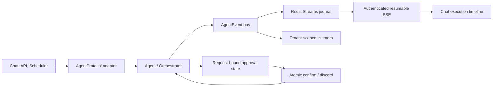

# Agent Execution Runtime

Ninko 1.6 introduces a common execution boundary for agents and a durable,
resumable event stream for observing nested work. The design keeps existing
agents compatible while giving jobs, pipelines, workflows, schedulers and user
interfaces one stable contract.

## Architecture



The runtime consists of these layers:

- `schemas.execution` defines `AgentRequest`, `AgentResponse`,
  `AgentFinishReason` and `AgentEvent`.
- `core.agent_protocol` adapts legacy `invoke()` and `route()` implementations
  to `AgentProtocol.run()`.
- `core.agent_events` provides process-local, tenant-filtered fan-out. Events
  are persisted before they are delivered to listeners.
- `core.agent_event_journal` stores sanitized events in Redis Streams and
  exposes replay and blocking reads.
- `api.routes_agents` exposes authenticated SSE and job replay endpoints.
- `frontend/core/agent_event_timeline.js` reconnects with cursors and reduces
  events into a bounded parent/child execution tree.
- `core.agent_approval` binds a pending destructive tool call to one random
  approval identifier and consumes it atomically.

## Execution contract

An agent implementation can expose the native protocol:

```python
class AgentProtocol(Protocol):
    id: str
    name: str
    description: str

    async def run(self, request: AgentRequest) -> AgentResponse: ...
```

Existing Ninko agents do not need an immediate rewrite. `as_agent_protocol()`
adapts `BaseAgent.invoke()`, while `as_orchestrator_protocol()` adapts
`Orchestrator.route()`. Callers must use `finish_reason` instead of inspecting
localized response text:

- `completed`: execution finished successfully;
- `approval_required`: interactive confirmation is required;
- `failed`: execution returned a structured failure;
- `cancelled`: execution or its parent request was cancelled.

## Event model

Every event contains:

- `event_id`: deduplication identifier;
- `type`: `started`, `status`, `token`, `tool_call`, `tool_result`,
  `approval_required`, `completed`, `failed` or `cancelled`;
- `tenant_id` and `session_id`: authorization and isolation scope;
- `run_id`: current execution identifier;
- `parent_run_id`: optional parent job, pipeline, workflow or step;
- `agent_id`: producer identity;
- `data`: bounded, JSON-compatible and sanitized metadata.

Terminal events close a run without implying that a child tool result completes
its parent. Consumers should build hierarchy from `run_id` and `parent_run_id`,
not from event arrival order.

## HTTP and SSE API

### Session stream

```http
GET /api/agents/events/stream?session_id=<id>&tail=true
Accept: text/event-stream
```

The session must already have an authenticated owner. The endpoint never claims
an ownerless session. To resume, pass either `after=<redis-stream-id>` or
`Last-Event-ID`; the query parameter takes precedence. With `tail=true`, the
server returns its baseline in `X-Agent-Event-Cursor`, avoiding client-clock
assumptions.

### Job replay

```http
GET /api/agents/jobs/<job_id>/events?after=<redis-stream-id>
```

Replay is strictly after the supplied cursor and includes descendants connected
through `parent_run_id`.

SSE frames use:

```text
id: 1753860000000-0
event: tool_call
data: {"event_id":"...","type":"tool_call",...}
```

Public cursors accept canonical Redis IDs only. Unicode digits, overflow values,
negative values, aliases such as `$`/`latest` and oversized input are rejected.

## Approval lifecycle

Pending destructive tool calls carry a cryptographically random `approval_id`.
The identifier is propagated to Telegram callback data and back into the resume
boundary. Confirm and discard operations compare the expected ID and delete the
Redis record in one Lua operation.

Consequences:

- an old button cannot confirm a newer request;
- an old cancel button cannot discard a newer request;
- identical tool names and arguments do not weaken replay protection;
- schedulers discard interactive approval state and finish as failed instead of
  leaving an unattended action pending.

Pending approvals expire after five minutes. A resumed multi-step pipeline
executes only the approved step and can pause again before the next destructive
step.

## Security and limits

- Journal keys use a hash of the session identifier and never expose the raw
  session in Redis key names.
- Tenant mismatches are rejected before persistence.
- Known secret fields and nested sensitive values are redacted centrally.
- Payloads, identifiers and cursors have explicit size limits.
- Malformed journal entries are skipped without logging their payload.
- Listener delivery is isolated, concurrent and time-bounded.
- Journal persistence failure does not stop the agent; repeated timeouts open a
  short circuit breaker.
- SSE connections are capped per principal and per process and close after a
  bounded lifetime.
- The browser reducer keeps at most 40 execution nodes and 1000 event IDs.

## Operations

Redis is required for durable replay. The process-local bus continues delivering
events when journal persistence is temporarily unavailable, but events produced
during that window cannot be replayed after reconnect.

Default retention is approximately 500 stream entries for 24 hours. Treat this
as operational trace data, not as an audit archive. Existing chat status events
remain available for compatibility; new integrations should consume
`AgentEvent`.

Useful checks:

```bash
curl -fsS http://localhost:8000/health
node --test frontend/tests/*.test.js
.venv/bin/pytest -q
.venv/bin/ruff check .
```

## Extension checklist

When adding a new execution container:

1. create a stable `run_id`;
2. propagate the surrounding run as `parent_run_id`;
3. set and reset the run context in `finally`;
4. emit exactly one `started` and one terminal event;
5. map cancellation to `cancelled` without retrying it;
6. keep event data free of secrets and large raw outputs;
7. add lifecycle, cancellation and tenant-isolation tests.
